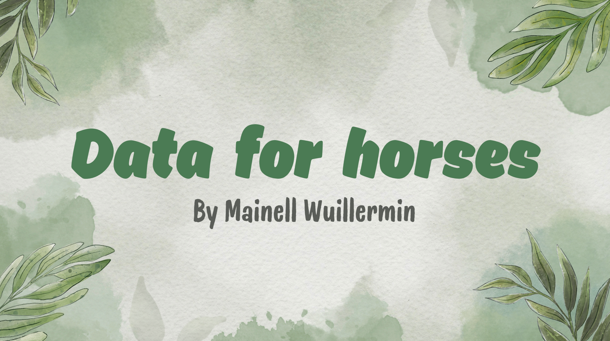

- 🎀 Hi, I’m @Mainell !

- 💝 I’m interested in data analysis and life with horses.
- ✨ I’m currently learning data sciences and natural horsemanship.
- 🪴 I’m looking to collaborate on environmental projects, particularly those involving horses !

- 📫 How to reach me ? https://www.linkedin.com/in/mainell-wuillermin/
- 🐺 How to pronouns my first name ? menɘl
- 🎓 Fun fact: I was a teacher for 8 years ! My best memory ? A trip in Copenhague with 30 students.

This is part of a "mini project" organized by Wild Code School :

